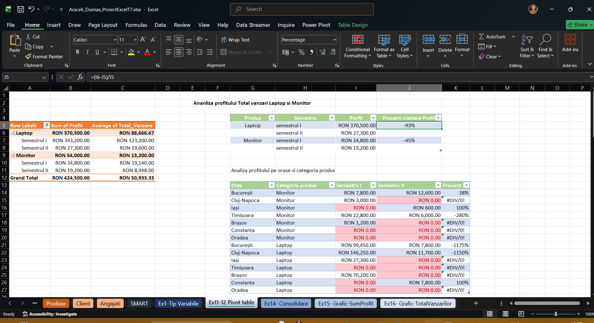
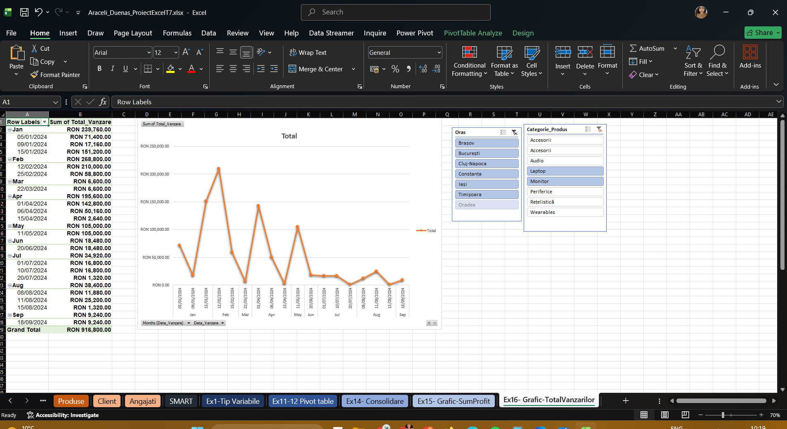
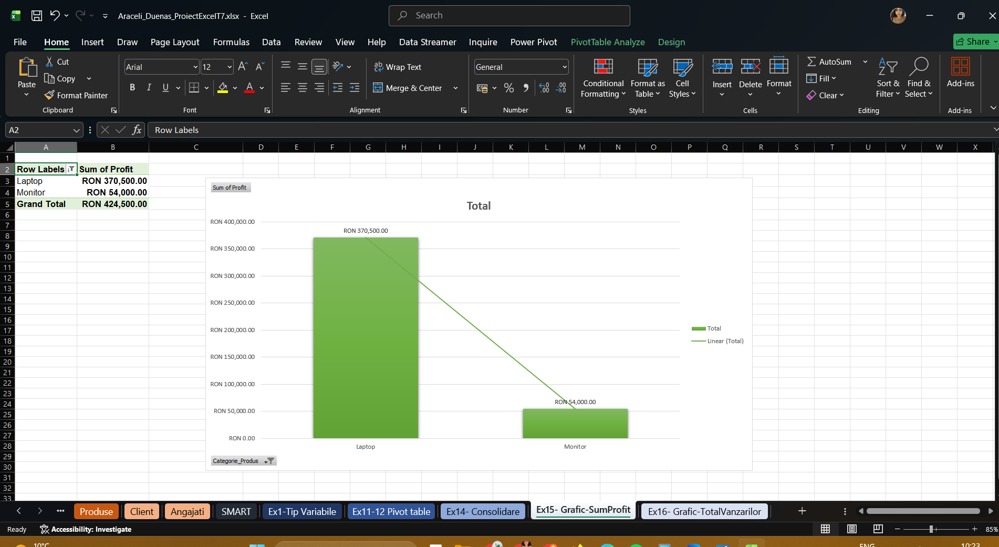
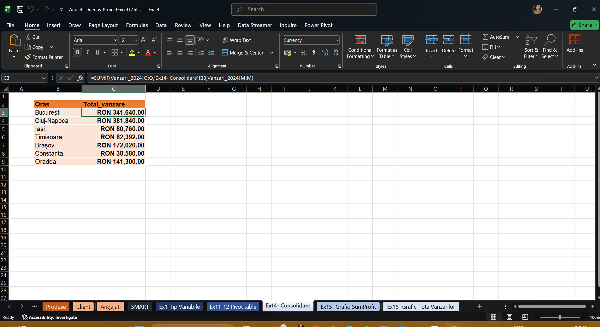

# SMART PROJECT

This project analyzes the **sales and profit performance** of the **Laptop** and **Monitor** product categories across multiple cities in **2024**, using **Microsoft Excel** and **Power Query**.

The main objective of the project is to evaluate business performance in the **first semester** and compare it with the **second semester**, in order to determine whether the company achieved a **minimum 10% increase in total profit**.

The analysis focuses on:
- profit evolution by product category
- sales performance by city
- semester-to-semester comparison
- identifying weak-performing areas
- supporting business decision-making through data analysis

**Dataset**

The project uses multiple Excel-based data sources, including:

- `Vanzari_2024`
- `Produse`
- `Clienti`
- `Angajati`

These files were imported into **Power Query** as separate queries and later combined into a structured analysis table.

## Workflow

I followed a structured workflow to clean, transform, analyze, and visualize the data.
Power Query

I imported the source files into **Power Query** and prepared the data for analysis.
 Data preparation steps included:
- importing all source files as separate queries
- checking headers and data types
- identifying missing values and inconsistent formatting
- standardizing incorrect product names
- renaming queries for clarity
- extracting **Year** from `Data_Vanzare` into a new field called `An_Vanzare`
- merging the `Vanzari_2024` table with the `Produse` table using `ID_Produs`

Fields added after merge:
- `Nume_Produs`
- `Categorie_Produs`
- `Pret_Unitat`
- `Cost_Unitat`

After cleaning and transformation, the data was loaded back into Excel for analysis.

**Excel Analysis**

After preparing the dataset, I used **Excel formulas**, **Pivot Tables**, and **charts** to perform the analysis.

## Dashboard Preview

### Pivot Table Analysis

### Total Sales Trend

### Profit by Product Category

### Consolidated Sales by City

## Final Analysis

### Profit by Product Category
Profit decreased significantly in Semester II compared to Semester I:
- Laptop: -93%, showing a severe decline
- Monitor: -45%, showing a moderate decline

### Analysis by City
For the Monitor category:
- Growth only in București (+38%)
- Strong decline in Timișoara (-280%)
- No profit in Cluj-Napoca and Brașov
- Low presence in Iași and critical performance in Oradea

For the Laptop category:
- No profit in Brașov and Iași
- Decline in București and Cluj-Napoca
- Critical performance in Timișoara and Oradea
- Limited activity in Constanța

### Profit Distribution
In Semester I, profit was concentrated in Cluj-Napoca, București, and Brașov.  
In Semester II, profit dropped significantly across most cities.

 **SMART Objective**
Target: +10% profit increase in Semester II  
Result:
- Laptop: -93%
- Monitor: -45%

The objective was not achieved.

***Causes***
- Decrease in Laptop sales
- Loss of profit in key cities
- Lower Semester II performance
- Fewer large orders

**Recommendations**
- Relaunch strategy for Laptop category
- Introduce discounts to increase large orders
- Focus campaigns on low-performing cities

### Conclusion
The analysis shows a significant decline in performance in Semester II. Strategic actions are required to improve results in the following months.

